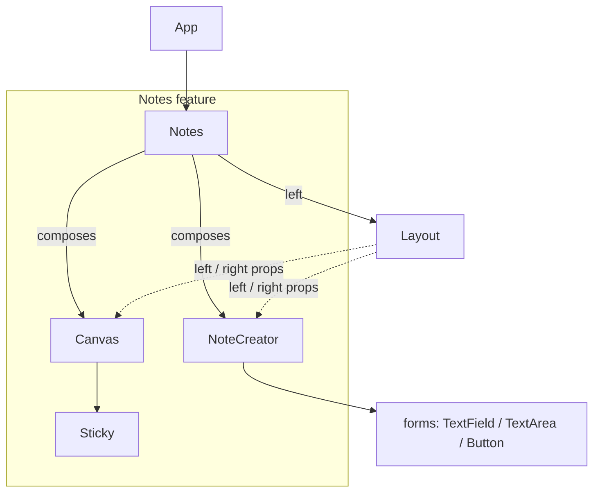
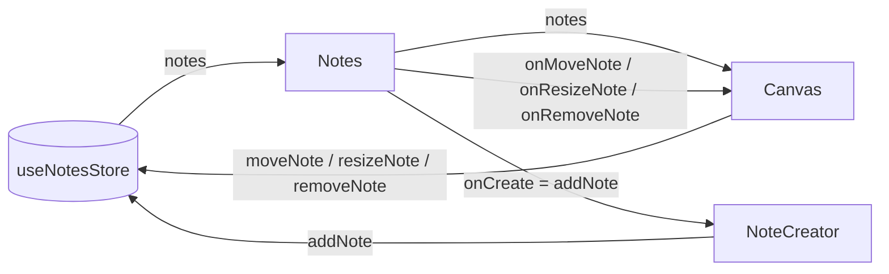

# Architecture

A high-level view of how Sticky Notes is put together. For file-level details see
[CODE.md](CODE.md).

## Overview

Sticky Notes is a single-page React + TypeScript app (built with Vite) that
renders a fixed **1024×768** workspace: a left **canvas** where sticky notes are
placed, moved, resized, and deleted, and a right **form** for creating new notes.
All note data lives in one Zustand store; components read from it at the feature
root and receive actions as props.

## Layers

```
UI components  ──►  read state + call actions
     │
     ▼
Zustand store  ──►  single source of truth for notes (owns all mutations)
     │
     ▼
Domain types (Note, NoteDraft)  +  Config constants (canvas size, defaults)
```

| Layer      | Location                                | Responsibility                                                                                         |
| ---------- | --------------------------------------- | ------------------------------------------------------------------------------------------------------ |
| Components | [`src/components/`](../src/components/) | Rendering + user interaction. One folder per component (`Component.tsx`, `Component.css`, `index.ts`). |
| State      | [`src/store/`](../src/store/)           | Zustand store — holds notes and the actions that mutate them.                                          |
| Types      | [`src/types/`](../src/types/)           | Shared domain shapes (`Note`, `NoteDraft`).                                                            |
| Config     | [`src/config/`](../src/config/)         | App constants: canvas dimensions, default/min/max sticky geometry.                                     |

## Component tree



- **`Layout`** — generic, presentational shell. Centers the fixed frame and takes
  `left`/`right` props; knows nothing about notes.
- **`Notes`** — the feature root. The **only** component that subscribes to the
  store; wires data and actions down as props.
- **`Canvas`** — renders a `Sticky` per note and owns all pointer interaction
  (drag-move, corner-resize, drag-to-trash-to-delete).
- **`Sticky`** — a pure view of one note; forwards its DOM pointer events up.
- **`NoteCreator`** — a local-state form that emits a new note via `onCreate`.
- **`forms/`** — reusable, prop-transparent field components sharing one stylesheet.

## Data flow

State is read at the root and flows **down as props**; mutations flow **up as
callbacks** into store actions. Leaf components stay store-agnostic.



The store owns every mutation and is the single source of truth. `NoteCreator`
and `Canvas` never touch the store directly — they call the callbacks `Notes`
hands them, so creation, movement, resize, and deletion all happen in the store
(which, for example, assigns each note's `id`).

## Interaction flows

- **Create** — `NoteCreator` collects `text`/`size`/`x`/`y` in local state; on
  **Create Note** it builds a `NoteDraft` and calls `onCreate` (→ `addNote`),
  then resets the form. The store assigns the `id`; `Canvas` re-renders the new
  `Sticky`.
- **Move** — pointer-down on a sticky body starts a drag (pointer capture).
  `Canvas` clamps the note inside the canvas and calls `moveNote`.
- **Resize** — pointer-down on a corner handle starts a resize. `resolveDragMode`
  distinguishes move vs. resize from the target's `data-corner`. The opposite
  corner stays fixed; size is clamped to `MIN_STICKY_SIZE` and the canvas bounds.
- **Delete** — dragging a sticky over the circular trash zone highlights it; on
  drop the note is removed via `removeNote`.

## Key patterns & conventions

- **Read at the root, pass props down.** Only `Notes` subscribes to the store.
- **Store owns mutations.** Components emit intent via callbacks.
- **Folder-per-component** with an `index.ts` barrel; import from the folder.
- **Named callbacks only** — no inline arrow callbacks in JSX; interaction
  handlers in `Canvas` are memoized with `useCallback`.
- **Shared styling for forms** via a single `field.css`; a `variant` enum styles
  `Button`.
- **Geometry constants live in `config/`**, not scattered as magic numbers.

See [CLAUDE.md](../CLAUDE.md) for the full conventions list.
